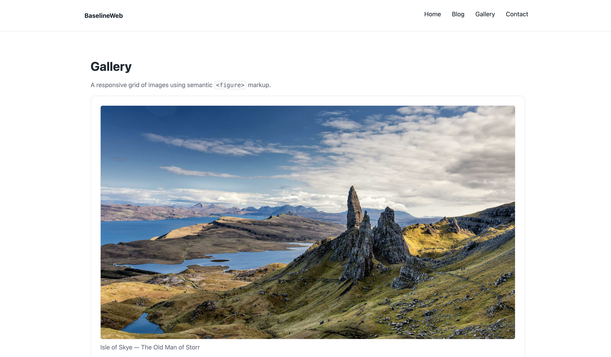
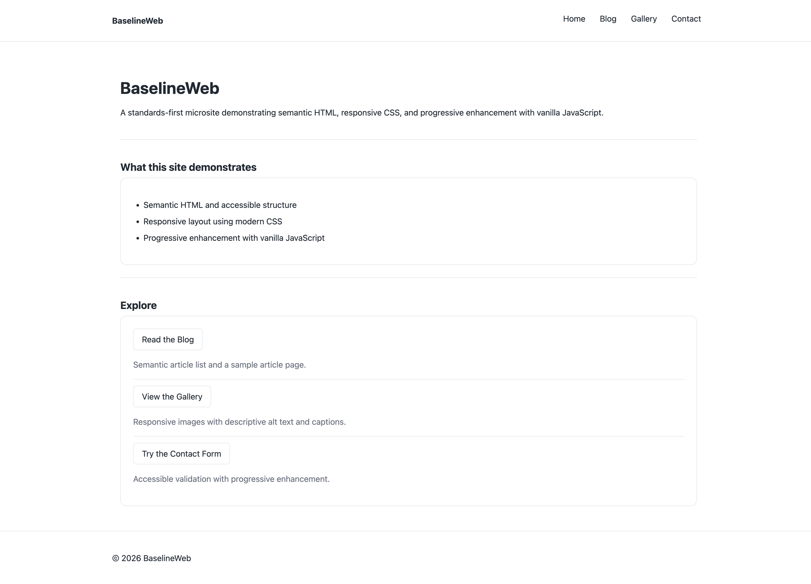
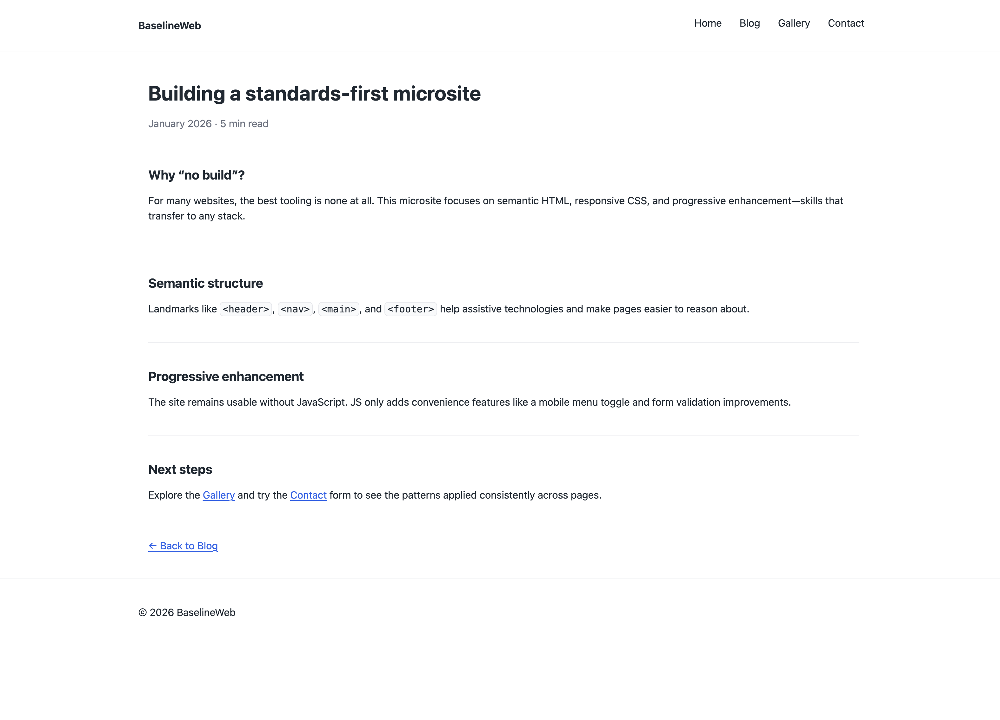
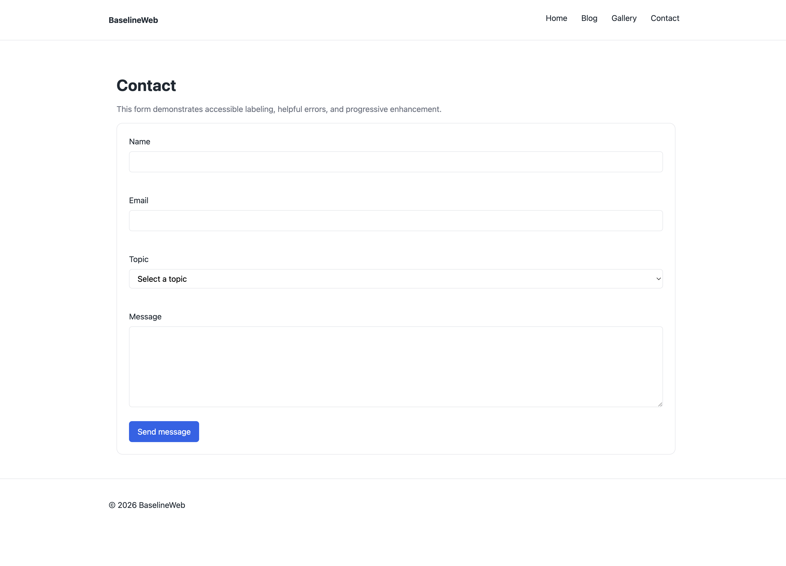

# BaselineWeb - A Standards-First Microsite

A no-build, standards-first website demonstrating semantic HTML, responsive CSS, and progressive enhancement with vanilla JavaScript.

This project exists to demonstrate core web fundamentals that apply across frameworks and stacks.

## Goals

- Semantic HTML structure using landmarks and accessible navigation
- Responsive layout using modern CSS (flex/grid) + media queries
- Progressive enhancement: the site works without JS; JS adds convenience
- Practical UI behaviors: mobile nav, form validation, responsive images

## Pages

- Home (index.html) — landing layout + sections
- Blog (pages/blog.html) — article list
- Article (pages/article.html) — sample article detail
- Gallery (pages/gallery.html) — responsive images
- Contact (pages/contact.html) — accessible form with validation

## Screenshots

Representative views highlighting semantic structure, responsive layout, and accessible UI patterns.

All interactions shown are keyboard-accessible and progressively enhanced.

## JavaScript features

- Mobile navigation toggle with keyboard support and ESC-to-close
- Form validation with accessible inline errors (aria-live) and field-level messaging

## CSS approach

- Small reset (assets/css/reset.css)
- Base typography and tokens (assets/css/base.css)
- Layout + breakpoints (assets/css/layout.css)
- Components (assets/css/components.css)
- Visible focus styles preserved for keyboard navigation

## Accessibility

- Skip link
- Semantic landmarks (header, nav, main, footer)
- Proper heading hierarchy
- Labels and input associations
- Keyboard navigation supported throughout

## Image credits

Gallery images are sourced from Unsplash and used for demonstration purposes.

## Run locally

- Open index.html directly in a browser, or use any static server:
- python -m http.server 5173 (optional)

## Deployment

- Works with any static host (GitHub Pages / Netlify / etc.)

## License

- MIT
